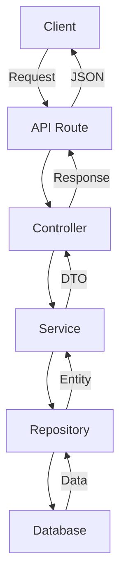

# アーキテクチャドキュメント

## 📁 プロジェクト構造

```
src/
├── app/                      # Next.js App Router
│   ├── api/                  # APIルート
│   └── (pages)/              # ページコンポーネント
│
├── core/                     # ビジネスロジック層
│   ├── domain/               # ドメインモデル
│   ├── repositories/         # データアクセス層
│   ├── services/             # ビジネスサービス
│   ├── controllers/          # APIコントローラー
│   ├── validators/           # バリデーションロジック
│   └── errors/               # カスタムエラー
│
├── infrastructure/           # インフラストラクチャ層
│   ├── database/             # データベース設定
│   ├── cache/                # キャッシュ実装
│   ├── email/                # メール送信
│   └── container.ts          # DIコンテナ
│
├── presentation/             # プレゼンテーション層
│   ├── components/           # UIコンポーネント
│   ├── hooks/                # カスタムフック
│   ├── contexts/             # Reactコンテキスト
│   ├── utils/                # UIユーティリティ
│   └── styles/               # スタイル
│
└── shared/                   # 共通リソース
    ├── types/                # 型定義
    ├── constants/            # 定数とEnum
    └── utils/                # 共通ユーティリティ
```

## 🏗️ アーキテクチャパターン

### レイヤードアーキテクチャ

本プロジェクトは **クリーンアーキテクチャ** の原則に基づいた3層構造を採用：

1. **Presentation Layer** (プレゼンテーション層)
   - UIコンポーネント
   - カスタムフック
   - ユーザーインタラクション処理

2. **Business Logic Layer** (ビジネスロジック層)
   - ドメインロジック
   - ビジネスルール
   - データ検証

3. **Data Access Layer** (データアクセス層)
   - データベース操作
   - 外部API通信
   - キャッシュ管理

### Repository Pattern

データアクセスをカプセル化し、ビジネスロジックから分離：

```typescript
// Repository Interface
interface IRepository<T> {
  findAll(params?: PaginationParams): Promise<T[]>
  findById(id: string): Promise<T | null>
  create(data: Partial<T>): Promise<T>
  update(id: string, data: Partial<T>): Promise<T>
  delete(id: string): Promise<void>
}

// Concrete Implementation
class ContactRepository extends BaseRepository<Contact> {
  // Contact特有のメソッド
  findByEmail(email: string): Promise<Contact | null>
  findByCompanyId(companyId: string): Promise<Contact[]>
}
```

### Service Pattern

ビジネスロジックをカプセル化：

```typescript
class ContactService {
  constructor(
    private repository: ContactRepository,
    private cache: CacheService,
    private validator: ValidationService
  ) {}

  async createContact(data: ContactFormData): Promise<Contact> {
    // 1. バリデーション
    this.validator.validate(data)
    
    // 2. ビジネスルール適用
    const processedData = this.applyBusinessRules(data)
    
    // 3. データ永続化
    const contact = await this.repository.create(processedData)
    
    // 4. キャッシュクリア
    await this.cache.invalidate('contacts:*')
    
    return contact
  }
}
```

### Dependency Injection

DIコンテナによる依存性管理：

```typescript
const container = new DIContainer()

// サービス登録
container.register('prisma', () => new PrismaClient())
container.register('contactRepository', () => 
  new ContactRepository(container.get('prisma'))
)
container.register('contactService', () => 
  new ContactService(
    container.get('contactRepository'),
    container.get('cacheService'),
    container.get('validationService')
  )
)

// 使用
const service = container.get<ContactService>('contactService')
```

## 🔄 データフロー



## 🚀 パフォーマンス最適化

### キャッシュ戦略

- **In-Memory Cache**: 頻繁にアクセスされるデータ
- **Browser Cache**: 静的リソース
- **API Response Cache**: Cache-Controlヘッダー

### データベース最適化

- **インデックス**: 検索フィールドに適切なインデックス
- **Select最適化**: 必要なフィールドのみ取得
- **N+1問題対策**: includeによる関連データの一括取得

### フロントエンド最適化

- **Code Splitting**: 動的インポート
- **React.memo**: 不要な再レンダリング防止
- **useMemo/useCallback**: 計算結果のメモ化
- **Debounce**: 検索入力の最適化

## 🔒 セキュリティ

### 入力検証

- サーバーサイドバリデーション
- SQLインジェクション対策 (Prisma使用)
- XSS対策 (React自動エスケープ)

### 認証・認可

- JWT トークン (実装予定)
- ロールベースアクセス制御 (実装予定)

## 🧪 テスト戦略

### Unit Tests
- Services
- Validators
- Utils

### Integration Tests
- API Routes
- Repository Methods

### E2E Tests
- Critical User Flows

## 📊 モニタリング

### ロギング

```typescript
// Development
prisma.$use(async (params, next) => {
  const before = Date.now()
  const result = await next(params)
  const after = Date.now()
  
  if (after - before > 100) {
    console.warn(`Slow query: ${params.model}.${params.action} took ${after - before}ms`)
  }
  
  return result
})
```

### メトリクス

- Response Time
- Error Rate
- Cache Hit Rate
- Database Query Performance

## 🔄 CI/CD

### Development Workflow

1. Feature Branch作成
2. 開発・テスト
3. Pull Request
4. Code Review
5. Merge to Main
6. Auto Deploy

### デプロイメント

- **Development**: localhost:3010
- **Staging**: Vercel Preview
- **Production**: Vercel Production

## 📝 コーディング規約

### TypeScript

- Strict Mode有効
- 明示的な型定義
- Interfaceを優先

### Naming Conventions

- **Components**: PascalCase
- **Functions**: camelCase
- **Constants**: UPPER_SNAKE_CASE
- **Types/Interfaces**: PascalCase

### File Organization

- 1ファイル1コンポーネント/クラス
- index.tsでのエクスポート集約
- 関連ファイルの近接配置

## 🔮 今後の改善予定

1. **GraphQL導入**: より効率的なデータフェッチ
2. **Redis導入**: 分散キャッシュ
3. **Microservices**: サービスの分割
4. **Event Sourcing**: イベント駆動アーキテクチャ
5. **CQRS**: 読み書きの分離